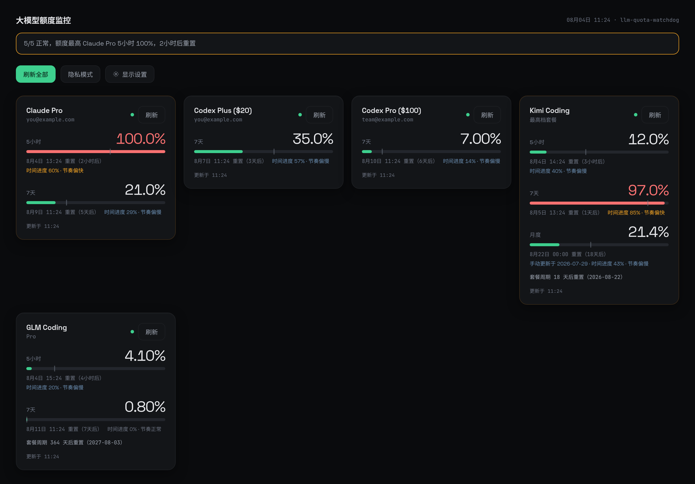
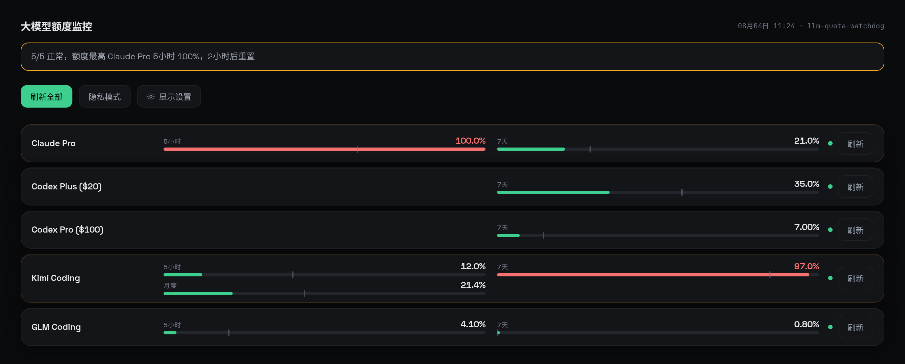

# llm-quota-watchdog

**One dashboard + smart push alerts for all your LLM coding-plan quotas.**
Claude Pro/Max · Codex Plus/Pro · Kimi for Coding · GLM Coding Plan

[中文文档](README_CN.md)

Python 3.8+, **stdlib only, zero dependencies**. Static HTML output, no database, no daemon.

---

## Why

Subscription coding plans (Claude Pro/Max, ChatGPT Codex, Kimi for Coding, Zhipu GLM Coding Plan) all have **5-hour and weekly quota windows**, but:

- none of them has a "remaining quota" page you can check in one place,
- relay panels (new-api, CPA-Manager-Plus, …) only show relay-side traffic, not the upstream subscription windows,
- Kimi for Coding has no documented quota API at all.

llm-quota-watchdog polls the same endpoints the official CLIs use, renders a single static page, and pushes alerts before you burn through a window — or when you're wasting one.

## What you get

### Dashboard (static HTML, regenerate on cron)

Per account: 5-hour / weekly / monthly (manual snapshot) progress bars with exact percentages, a time-progress marker on each bar, reset countdowns, usage-vs-time pace (fast/slow), plan expiry countdown. Dark theme, responsive multi-column grid that keeps even a long account list on one screen.

A one-line summary at the top tells you who to worry about right now: `5/5 healthy, fullest is Codex Pro weekly 100%, resets in 4d`. It turns amber when an account is close to its ceiling.



Two toolbar buttons:

- **Privacy mode**: one click hides email subtitles, per-account fetch times, and the page timestamp for clean screenshots with no identifying info. Active only for the current tab (reloads clear), and the button turns amber so you remember to turn it off.
- **Settings** — pure frontend, lives in the visitor's `localStorage`, needs no backend, doesn't change what anyone else sees:

| What | Options |
|---|---|
| Theme | **follow system** / dark / light (auto day/night by your OS; or pin one) |
| Density | comfortable / compact / **mini** (one row per account — always one screen, however many you have) |
| Columns | auto / 1 / 2 / 3 / 4 |
| Accounts | show or hide each one, reorder with ↑↓ |
| Sorting | custom order / by usage (most-burnt first) |
| Details | health badge, card subtitle, reset time, pace hint, fetch time, plan expiry, top summary — each toggleable |
| Auto refresh | off / 5 min – 3 h |
| Backup | copy config / download file / paste-import / upload file, reset to defaults |



> Sharing a screenshot but don't want your email in it? Use the "Privacy mode" toolbar button instead.

The page also has a "refresh all" button and a per-account refresh link. These are plain links to `/refresh` (optionally `?account=<label>`) — this repo doesn't ship a server for that endpoint, so if you don't wire one up the buttons just 404 and the static page itself is unaffected. See [Optional: on-demand refresh](#optional-on-demand-refresh) below for a minimal example.

### Push alerts (Bark / ntfy)

| Alert | Trigger |
|---|---|
| 🔴 Nearly used up | 5h ≥ 80%, weekly ≥ 90% (message includes reset countdown) |
| 🟠 Burning too fast | usage 15 points ahead of time pace in the weekly window |
| ⏱ Pace indicator | every window shows time elapsed vs. usage — fast/slow at a glance |
| 🟡 Use it or lose it | half the window gone but usage 30+ points behind · or ≤26h to reset with ≤60% used |
| 🟢 Refilled | window reset detected (usage dropped 30+ points) |
| 📅 Plan expiring | 7 / 3 / 1 days before a manually-configured plan expiry date |
| 📊 Daily summary | full report once a day, pushed regardless |

Every alert fires **once per window per cycle** (state-file dedup) — no spam.
Accounts on a big plan you don't want to be nagged about can be listed in `relaxed_accounts` (they keep only the "nearly used up" alert).

### Optional: CLIProxyAPI auth-file health check

If you run [CLIProxyAPI](https://github.com/router-for-me/CLIProxyAPI), set `cliproxyapi_management_key_file` in config to point at a file with its management-API key. This unlocks:

- a 🟢/🔴/🟡 health badge on each dashboard card (plus a summary banner when something's off), sourced from CLIProxyAPI's own local management API — not from a failed quota request, so it's accurate even before the upstream quota call would notice
- the `check-auth` subcommand, which pushes a Bark/ntfy alert only when the set of unhealthy auth files *changes* (token expired → alert; recovers → alert; otherwise silent)

This check is a **local** call (`http://127.0.0.1:8317/...` by default) — it isn't subject to the "don't hammer the upstream API" concern the polling frequency below is about. Even so, `check-auth` is meant to run from its own **low-frequency** cron line (daily is plenty for "did my token expire") — it's deliberately not folded into the hourly `watchdog` loop, since a token that's still expired an hour later doesn't need a second alert.

If you don't set `cliproxyapi_management_key_file`, none of this activates: no badges, no banner, `check-auth` is a silent no-op. Fully optional.

## Data sources

The tool calls the exact endpoints the official CLIs use:

| Provider | Endpoint | Credentials |
|---|---|---|
| Claude | `api.anthropic.com/api/oauth/usage` | OAuth token from CLIProxyAPI auth file (auto-discovered) |
| Codex | `chatgpt.com/backend-api/wham/usage` | OAuth token + account id from CLIProxyAPI auth file (auto-discovered) |
| Kimi for Coding | `api.kimi.com/coding/v1/usages` | your coding-plan API key (`sk-...`, from the kimi.com console) |
| GLM Coding Plan | `open.bigmodel.cn/api/monitor/usage/quota/limit` | your Zhipu API key (passed in the `Authorization` header directly, **no Bearer prefix**) |

If you run [CLIProxyAPI](https://github.com/router-for-me/CLIProxyAPI), just point `cliproxyapi_auth_dir` at its auth dir — every Claude/Codex account is picked up automatically, no extra config.

> Kimi's **monthly overall quota** (the one in the web console, mixing Kimi chat + Code) is not exposed by any API. The dashboard supports a manually-updated snapshot for it (`monthly_snapshot`).

## Quickstart

```bash
curl -fsSL https://raw.githubusercontent.com/toolazytoname/llm-quota-watchdog/main/install.sh | bash
```

The installer downloads the script, creates `~/.local/share/llm-quota-watchdog/config.json`, asks for your Bark URL / Kimi key / auth dir, and installs cron jobs:

```
47 * * * *  watchdog            # hourly silent check, pushes only when a rule fires
 5 9 * * *  watchdog --summary  # daily full report at 09:05 server local time
12 * * * *  page                # hourly static page regeneration
```

If you configured `cliproxyapi_management_key_file`, add the optional daily health check too (see [above](#optional-cliproxyapi-auth-file-health-check) for why this is a separate, low-frequency line rather than part of `watchdog`):

```
0 18 * * *  check-auth          # once a day is enough — pushes only on change
```

Test it:

```bash
llm-quota-watchdog watchdog --summary --config ~/.local/share/llm-quota-watchdog/config.json
llm-quota-watchdog page --config ~/.local/share/llm-quota-watchdog/config.json
```

Serve the page with any web server, e.g. nginx:

```nginx
location /quota/ {
    auth_basic "quota";
    auth_basic_user_file /etc/nginx/.htpasswd-quota;
    alias /home/YOU/.local/share/llm-quota-watchdog/www/;
}
```

> ⚠️ The dashboard reveals your subscription usage — put it behind auth or on a private network.

## Manual install

```bash
mkdir -p ~/.local/share/llm-quota-watchdog
cp quota_watchdog.py ~/.local/share/llm-quota-watchdog/
cp config.example.json ~/.local/share/llm-quota-watchdog/config.json
$EDITOR ~/.local/share/llm-quota-watchdog/config.json
```

## Configuration

See [config.example.json](config.example.json) — every key has a sane default. Highlights:

| Key | Meaning |
|---|---|
| `bark_url` / `ntfy_url` | push channel(s); either, both, or none |
| `bark_url_file` / `ntfy_url_file` | same, but read from a file so the key stays out of config.json; the file wins if both are set |
| `page_title` | dashboard heading (default: 大模型额度监控) |
| `cliproxyapi_auth_dir` | directory with CLIProxyAPI OAuth `*.json` files; Claude/Codex auto-discovered |
| `accounts` | explicit account list; also the default card order. Each entry takes `label` (card title), `sub` (subtitle, e.g. the email or plan tier), `api_key`/`api_key_file` (Kimi/GLM) or `auth_file` (Claude/Codex) |
| `relaxed_accounts` | labels that only get the "nearly used up" alert |
| `plan_expiry` | `{"Kimi Coding": "2026-08-22"}` → countdown on page + expiry alerts (keyed by account label) |
| `monthly_snapshot` | manually-maintained monthly quota shown on the page (keyed by account label) |
| `thresholds` | every alert threshold is tunable |
| `timezone_offset_hours` | display/report timezone (default UTC+8) |
| `page_state_file` | page cache holding each account's last fetch; what makes `page --account` able to refresh just one |
| `cliproxyapi_management_key_file` | optional; enables auth-file health badges + `check-auth` (see above) |
| `cliproxyapi_management_url` | CLIProxyAPI management API URL, default `http://127.0.0.1:8317/v0/management/auth-files` |

Leaving `accounts` empty still works: Claude/Codex are auto-discovered from `cliproxyapi_auth_dir` and each card is titled after its auth filename. Add entries to `accounts` when you want nicer titles and subtitles — an auth file you configured explicitly is not auto-discovered a second time, so listing one of your two Codex accounts by hand won't drop the other.

## Partial refresh

`page` re-queries every account by default. With `--account` (repeatable) it re-queries only those, rendering the rest from `page_state_file`:

```bash
llm-quota-watchdog page --account "Kimi Coding" --account "GLM Coding"
```

Two side benefits of that cache: when one account's fetch fails its card keeps the previous numbers and goes red instead of blank, and every card shows its own "updated HH:MM".

## Optional: on-demand refresh

The dashboard's refresh buttons just link to `/refresh` / `/refresh?account=<label>` — wire up whatever you like behind that path. A minimal example: a tiny local HTTP server that reruns `page` (scoped to one account when asked) and 302s back, proxied through your existing web server under the same auth so the endpoint isn't public:

```python
# refresh_server.py — listens on 127.0.0.1 only
import http.server, socketserver, subprocess, urllib.parse

class Handler(http.server.BaseHTTPRequestHandler):
    def do_GET(self):
        qs = urllib.parse.parse_qs(urllib.parse.urlparse(self.path).query)
        account = (qs.get("account") or [None])[0]
        cmd = ["llm-quota-watchdog", "page"]
        if account:
            cmd += ["--account", account]   # re-query just this one, cache for the rest
        subprocess.run(cmd, timeout=60)
        self.send_response(302); self.send_header("Location", "/"); self.end_headers()

with socketserver.ThreadingTCPServer(("127.0.0.1", 8791), Handler) as httpd:
    httpd.serve_forever()
```

nginx in front of it:

```nginx
location = /refresh {
    auth_basic "quota";
    auth_basic_user_file /etc/nginx/.htpasswd-quota;
    proxy_pass http://127.0.0.1:8791/refresh;
}
```

Add your own debounce (e.g. skip re-running if the last run was <20s ago) if the page might get multiple clicks in a row.

## FAQ

**Does polling these endpoints risk my account?**
The endpoints are the ones the official CLIs call. Once an hour from the same IP that already serves your traffic is well within normal client behavior. That said, using subscription OAuth tokens through any third-party proxy is outside the vendors' intended use — that's a pre-existing risk of your setup, not something this tool meaningfully adds to.

**Why does my Codex account only show a weekly window?**
For Plus/ProLite plans, `wham/usage` returns the weekly limit as `primary_window`. The tool labels windows by their actual reset distance, so what you see is what your plan actually has.

**Kimi weekly shows 100 requests — is that requests or %?**
The API returns `used`/`limit` counts; the tool converts to percentages.

**My push notifications never arrive.**
Make sure your Bark/ntfy URL is reachable from the host (`curl` it). Bark keys rotate if you reinstall the app — update `bark_url` after reinstalling.

## Security notes

- All credentials stay on your machine: OAuth files are read in place; the Kimi key lives in a `chmod 600` file.
- `config.json` may contain secrets — it is gitignored; never commit it.
- The tool makes outbound calls only to each provider's official usage endpoint plus your push channel.

## Roadmap / contributing

PRs welcome: Server酱/Telegram push channels, more providers (Gemini CLI, Qwen Code, Antigravity), Docker image, i18n page.

## License

[MIT](LICENSE)
